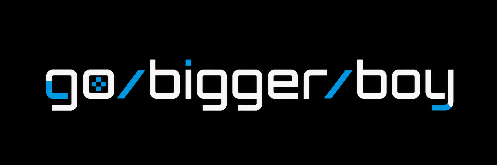

<p align="center">
  
</p>

<p align="center">
  <a href="https://github.com/DanielSeim/go-bigger-boy/actions/workflows/desktop-builds.yml"></a>
  <a href="https://github.com/DanielSeim/go-bigger-boy/actions/workflows/android-build.yml"></a>
  <a href="https://github.com/DanielSeim/go-bigger-boy/actions/workflows/web-pages.yml"></a>
</p>

<p align="center">
  <a href="https://danielseim.github.io/go-bigger-boy/"><strong>Try the latest web build on GitHub Pages</strong></a>
</p>

A portable, dependency-free C++17 Game Boy emulator. Platform frontends
(desktop, Android, and Switch) will live outside the core so emulation logic is
shared everywhere.

## Current status

The current automated baseline passes **168/168 tests**: 167 ROM and
framebuffer conformance cases, including **20/20 exact visual comparisons**,
plus the core unit-test executable. See the [accuracy report](docs/accuracy.md)
for the suite-by-suite breakdown.

- Cartridge loading and basic header parsing
- Initial DMG memory map, including work RAM echo behavior
- Complete legal CPU opcode set, including all 256 CB-prefixed operations
- Interrupt dispatch, EI delay, HALT/STOP states, HALT bug, and machine-cycle bus timing
- Cycle-driven DIV/TIMA/TMA/TAC timer with overflow interrupts and write-edge behavior
- DMG PPU modes, LCD/STAT interrupts, VRAM/OAM arbitration, and RGBA framebuffer
- Background, window, and 8×8/8×16 sprite scanline rendering, including the
  window's internal line counter and variable Mode 3 fetch timing
- Game Boy Color mode with banked VRAM/WRAM, RGB555 palettes, tile attributes,
  CGB sprite priority, VRAM DMA, fast serial, and double-speed CPU switching
- Active-low joypad matrix with keyboard/gamepad input and interrupts
- Cycle-timed OAM DMA with source-bus conflicts and an optional SDL3 desktop frontend
- Four-channel DMG/CGB audio with a cycle-integrated high-pass mixer and 48 kHz
  stereo SDL3 playback
- ROM-only, MBC1/MBC1M, MBC2, MBC3 (including RTC), and MBC5 banking
- Persistent battery-backed `.sav` RAM and MBC3 `.rtc` clock state
- Table-driven CPU tests for opcode matrices, timing, flags, PC, stack, and memory effects
- Headless command-line runner
- Headless Mooneye/serial conformance test runner
- SDL desktop local link sessions with two synchronized emulator cores
- Emscripten/WebAssembly browser frontend with IndexedDB cartridge saves
- Android native library/settings dashboard with SDL3 gameplay and multitouch controls
- Shared desktop/Android ROM catalog with fingerprint-deduplicated history and metadata
- Portable desktop `settings.ini` with shareable palette, keyboard, and gamepad mappings
- Game Boy Printer serial protocol with automatic desktop image export
- Game Boy Camera cartridge support with live SDL3 webcam input on desktop
- MBC5 rumble output through compatible SDL3 gamepads on desktop
- Versioned, ROM-validated save states with configurable save/load, fast-forward,
  and rewind controls
- Dependency-free unit tests

This is an early emulator with incomplete game compatibility. Game Boy Color
support covers the primary execution and rendering paths, but hardware-edge
accuracy is still being refined. DMG games can use the automatic Game Boy Color
compatibility palettes selected from their cartridge headers.

## License

Unless otherwise noted, Go Bigger Boy source code is licensed under the GNU
General Public License, version 3 or later (`GPL-3.0-or-later`); see
[LICENSE](LICENSE) for the complete terms.

ROMs, save files, and other user-provided game data are not covered by this
project license. Third-party libraries, tools, artwork, and metadata retain
their own licenses; the relevant notices and upstream projects are linked
where they are used.

## Build

```sh
cmake -S . -B build
cmake --build build
ctest --test-dir build --output-on-failure
```

Inspect a ROM and execute a requested number of starter instructions:

```sh
./build/gbb_cli path/to/game.gb 10
```

Export the current hardware scene as machine-readable JSON after optionally
executing instructions:

```sh
./build/gbb_cli path/to/game.gb 10 --scene-json scene.json
```

The file uses the versioned `gbb.scene.v1` schema and includes display
registers, background/window tile maps, decoded tile graphics and palettes,
plus OAM sprite metadata. The same schema is available through
`gbb::scene_snapshot_to_json` and the web frontend's **Export scene JSON**
button, allowing external renderers and analysis tools to consume snapshots
without linking against emulator internals.

Run an individual acceptance-test ROM with a bounded cycle budget:

```sh
./build/gbb_test_runner path/to/test.gb --max-cycles 100000000
```

The runner recognizes Mooneye's `LD B,B` result protocol and serial test output
containing `Passed` or `Failed`, plus Blargg's `$A000` memory result protocol.
Use `--protocol mooneye`, `--protocol serial`, or `--protocol blargg` to disable
automatic protocol detection. Model-specific post-boot tests can select
`--model dmg0`, `dmg`, `mgb`, `sgb`, `sgb2`, `cgb0`, or `cgb`.

The APU passes all 12 upstream Blargg `dmg_sound` tests and all 12 `cgb_sound`
tests, including model-specific power behavior, active wave-RAM access, and the
original DMG hardware's channel 3 retrigger corruption.
The current headless CI accuracy gate passes all 75 Mooneye acceptance ROMs,
all 6 applicable CGB misc ROMs, all 28 emulator-only mapper ROMs, 38 curated
Blargg ROMs, and 20 exact Acid2/Scribbltests/Mealybug/Gambatte framebuffer
comparisons; see the
[accuracy report](docs/accuracy.md) for details.

To register the curated 143-ROM CI baseline locally, download and extract the
`c-sp/game-boy-test-roms` v7.0 bundle, then set its root as the opt-in cache
path. Test ROMs are deliberately not bundled or downloaded by the build:

```sh
cmake -S . -B build-conformance \
  -DGAMEBOY_TEST_ROM_DIR=/path/to/game-boy-test-roms-v7.0
cmake --build build-conformance
ctest --test-dir build-conformance -L conformance --output-on-failure
```

The headless runner can also capture a deterministic framebuffer without SDL:

```sh
./build-conformance/gbb_test_runner test.gb \
  --model dmg --frames 60 --frame-output capture.ppm
```

When SDL3 is installed, CMake also builds the desktop frontend. Launching it
without arguments opens the game library dashboard:

```sh
./build/gbb
```

On Windows, the running-game window uses a native menu bar instead of drawing
a hamburger button over the Game Boy framebuffer. Its File, Emulation, View,
Tools, and Help menus expose ROM/library navigation, save states, pause/reset,
fullscreen, every palette and video pipeline, control settings, GameShark,
debugger and movie/TAS/sprite tools, shortcuts, and application information.
Unavailable game-specific actions are disabled until a ROM is loaded, while
active palette, video, pause, fullscreen, and recording choices are checked.

While a game is running, press `F12` to open the desktop debugger. It shows the
complete CPU register file, flags, execution state, cycle count, important
LCD/interrupt registers, and a nearest-neighbor framebuffer preview outlined
at the Game Boy's 160x144 visible viewport. The debugger pauses when opened;
use `F5` to run or pause, `F10` to advance one CPU instruction, and `F11` to
advance one frame. The same actions are available as clickable buttons. While
paused, click an individual CPU register value to edit it in hexadecimal;
press Enter to apply the value or Escape to cancel the edit.

The debugger also provides deterministic input movies. Press `F6` to start a
recording and `F6` again to stop and save it; press `F7` to replay the latest
recording. A recording includes its starting emulator state, ROM fingerprint,
and cycle-timestamped Game Boy button transitions, so replay starts from the
same state and rejects a different ROM. The latest movie is stored as
`replays/last-input.gbbmovie` in GBB's settings directory (beside the executable
in the portable Windows build).

An input movie is a binary `GBBMOV1` file. For reference, the following is an
annotated, human-readable representation of a short sample recording (the
embedded starting state is abbreviated):

```text
format: GBBMOV1
rom_fingerprint: 0x87604941b8eda76f
starting_state: <embedded GBB save state, 292009 bytes>
events:
  - cycle: 0       button: Start  pressed: true
  - cycle: 70224   button: Start  pressed: false
  - cycle: 280896  button: Right  pressed: true
  - cycle: 561792  button: A      pressed: true
  - cycle: 632016  button: A      pressed: false
  - cycle: 842688  button: Right  pressed: false
```

This represents Start being held for one frame, followed later by Right and A.
Cycle offsets are measured from the embedded starting state. The fingerprint
shown above is illustrative: a real recording can only be replayed with the ROM
whose fingerprint is stored in that file. GBB creates a usable sample for the
currently loaded ROM as soon as `F6` starts and then stops a recording.

### TAS frame editor

Press `F8` in the debugger to open the tool-assisted input editor. Each row is
one emulated frame and each column is a Game Boy button; click a cell to hold
that button for the entire frame. The editor supports inserting, deleting, and
appending frames, saving the timeline, replaying it from its captured starting
state, and starting a new timeline from the emulator's current state.

- Arrow Up/Down: select a frame
- Insert: insert an empty frame before the selection
- Delete: remove the selected frame
- End: append an empty frame
- Ctrl+S: save to `replays/last-input.gbbmovie`
- F7: save and run the timeline
- Ctrl+N: discard the timeline and capture the current emulator state

Normal input recordings and TAS timelines use the same deterministic movie
format, so the latest result can be replayed with `F7` from the debugger.

### Live sprite editor

Press `F9` in the debugger to open the paint-style VRAM tile editor. The tile
browser displays all 384 current 8x8 tiles; select one to edit it in a magnified
pixel grid. Choose color index 0-3 with the palette swatches or number keys,
then paint with the left mouse button. The right mouse button paints color 0.
`Ctrl+Z` restores the tile from before the last stroke, Delete clears it, and
`B` switches between CGB VRAM banks.

Sprite edits can be stored in two patch formats:

- `Ctrl+S` saves `sprite-patches/last-sprite-edit.gbbtiles`, a GBB live-tile
  patch containing the ROM fingerprint plus original and replacement tile data.
- `Ctrl+O` imports that live-tile patch into the matching ROM session.
- `Ctrl+E` exports `sprite-patches/last-sprite-edit.ips`, a standard IPS patch
  for use with external ROM patchers.

IPS export is deliberately conservative. It only includes an edited tile when
its original 16-byte bitplane data occurs exactly once in the ROM. Tiles whose
source is compressed, generated dynamically, duplicated, or otherwise
ambiguous are skipped and reported. The GBB live-tile format remains available
for those tiles because it applies directly to VRAM instead of guessing a ROM
offset. IPS exports also include updated Game Boy header and global checksums.

Edits are applied directly to the running emulator's VRAM and appear
immediately. They do not modify the ROM file, and a game can overwrite the
edited tile after execution resumes. This makes the editor suitable for live
graphics experiments and debugging without risking the original ROM.

### GameShark cheat manager

While a desktop game is running, press `Ctrl+G` to open its ROM-specific cheat
manager. Click **Fetch for ROM** to retrieve the matching Game Boy or Game Boy
Color collection from the [Libretro Database](https://github.com/libretro/libretro-database),
or enter a description and code to add a manual cheat. Archive results, manual
entries, and enabled states are cached per ROM fingerprint in `cheats/*.cht`.
No ROM data is uploaded. Libretro Database content is distributed under
[CC BY-SA 4.0](https://github.com/libretro/libretro-database/blob/master/LICENSE).

Click the checkbox beside a cheat (or select it and press Space) to enable or
disable it. Delete removes the selected entry. Multiple writes can be joined
with `+`, for example `019973D5+019974D5`. GBB currently accepts conventional
Game Boy/Game Boy Color GameShark type-01 writes (`01VVLLHH`); unsupported
engines and code types are rejected rather than interpreted ambiguously.
Opening the manager pauses gameplay and restores the previous pause state when
the window closes. Downloads show progress and can be cancelled by closing the
manager.

The dashboard lists up to twelve fingerprint-deduplicated recent ROMs. Windows
uses a native library window with game, platform, language, and last-played
columns plus a dedicated Settings page for palettes and control remapping.
Its Shortcuts page provides a complete in-app reference using the currently
configured bindings. Press `F1` from the dashboard or while playing to open the
same reference; Linux also exposes it as a dashboard entry.
Entries can be removed without deleting ROM or save files. It resolves canonical
metadata and caches box artwork from
Libretro without uploading ROM contents. Press Ctrl+L or choose
**File > Game Library** to return to the Windows dashboard while playing.
You can also pass a ROM path, press Ctrl+O to choose another ROM, or drag a
`.gb`/`.gbc` file onto the emulator window. On Windows, build with Visual
Studio and an SDL3 installation visible to CMake. `gbb --version` prints the
version embedded in a desktop build:

```powershell
cmake -S . -B build-windows -G "Visual Studio 17 2022" -A x64 `
  -DCMAKE_PREFIX_PATH=C:\path\to\SDL3
cmake --build build-windows --config Release
.\build-windows\Release\gbb.exe
```

When using SDL3's shared package, the build also copies its runtime DLL beside
the executable.

### Linux desktop

Install a C++ compiler, CMake, SDL3 development files, curl, and an XDG desktop
portal. On Debian/Ubuntu distributions where SDL3 packages are available:

```sh
sudo apt install build-essential cmake curl libsdl3-dev xdg-desktop-portal
cmake -S . -B build-linux -DCMAKE_BUILD_TYPE=Release
cmake --build build-linux --parallel
./build-linux/gbb
```

For a per-user installation with an application-menu entry and ROM file
association:

```sh
cmake --install build-linux --prefix "$HOME/.local"
```

The installed desktop entry accepts `.gb` and `.gbc` files from Linux file
managers. The native ROM picker uses SDL's portal-backed file dialog on
Wayland and supported X11 desktops.

Keyboard controls are arrows for the D-pad, X for A, Z for B, Enter for
Start, Backspace for Select, and Escape to quit. Standard gamepads are also
supported. Desktop shortcuts are Space to pause, Ctrl+R to reset, F11 for
fullscreen, Ctrl+L for the recent-ROM list, Ctrl+1 through Ctrl+9 for quick
recent selection, Ctrl+K to configure and persist controls, Ctrl+P to choose
between Grayscale, Classic green, Game Boy Pocket, Amber, and the automatic
Game Boy Color compatibility palette,
the configurable SaveState, LoadState, FastForward, and Rewind shortcuts, and
F1 for help. Recent ROMs,
window positions, and per-ROM quick saves are stored with the desktop data. On
Windows, all desktop data (including saves, recent-ROM metadata, quick states,
printer output, updater files, and settings) is kept beside `gbb.exe`, making
the extracted folder portable. Linux and macOS continue to use SDL's per-user
preferences directory. Desktop keyboard/gamepad bindings and the display palette
are stored in the human-readable `settings.ini` at the data root. Each
Game Boy button accepts up to two space-separated keyboard keys (for example,
`keyboard.B = Z Y`). Copy the file to another GBB installation to share the
same setup. On Windows, the native Settings page presents primary and secondary
buttons over a Game Boy control illustration: click a slot and press its new
key, press Delete while capturing a secondary slot to clear it, or reset every
keyboard control and emulator shortcut at once. The same page also exposes
Fast Forward, Rewind, Save State, and Load State shortcut buttons. Reusing a
key automatically removes its earlier assignment. The Ctrl+K dialog can also
rebind keyboard or gamepad input; Space skips an optional secondary key and
Escape cancels an in-progress setup. GBB
generates a complete default
`settings.ini` at startup whenever it is missing and appends defaults for any
recognized entries omitted from an existing file. Older `controls.txt` and
`palette.txt` preferences migrate automatically when `settings.ini` is first
created, and automatic updates preserve an existing portable file. On Android,
tap the top-left menu button and choose
`Display palette` to select and persist the same five palette options. The
Android Settings page also provides touch-control size and opacity sliders;
these values are stored in `settings.ini` as `touch.Size` and `touch.Opacity`.
Voxel modes also support touch-drag orbiting when `touch.VoxelOrbit` is enabled;
the Android Settings page provides a toggle for this gesture. The in-game menu
button can be placed at the top left or top right with `touch.MenuPosition`.
Its layout editor has separate portrait and landscape layouts. The D-pad is
always moved as one control, while A, B, Select, and Start can be positioned
individually beside or below the emulation screen. Positions are stored as
normalized `touch.Portrait.*` and `touch.Landscape.*` coordinates.

The video pipeline is configurable across desktop, Android, and web builds:
`nearest` keeps crisp pixel edges, `bilinear` smooths the presentation, `sharp`
adds edge-aware smoothing without blanket blur, `integer` uses only whole-number
scale factors, and `lcd` applies a lightweight LCD mask with scanlines. The
setting is stored as `video.Mode` in
`settings.ini`; the web selector remembers its choice in browser storage.
Desktop, Android, and web builds also expose three experimental voxel modes. `voxel` is the
original one-source-pixel relief renderer. `voxel_shape` (shown as “Voxel
diorama (shape-aware)”) keeps the source-pixel silhouette intact, then applies
edge-aware depth and stronger per-layer volume so sprites read as compact 3D
forms without the chunky blobs caused by coarse 2×2 grouping. Desktop and web
provide camera controls; all voxel modes share profiles, layer ordering, and the
optional framebuffer facade, and can be switched while a ROM is running.
Android currently uses the configured profile defaults. `voxel_popup` (shown as “Voxel
pop-up book”) lays the framebuffer out as a horizontal page, raises the window
layer above it, and renders OAM sprites plus substantial connected tile-layer
shapes as upright, page-anchored cuboids. Small isolated texture/dither pixels
remain on the page. This is useful for overhead games such as Pokémon, where
buildings and terrain are normally drawn by the background tile layer.
Unsupported frontends fall back to the regular 2D presentation.
In the web build, drag the voxel canvas horizontally to orbit around the
center axis and vertically to adjust the pitch. Angles are clamped to keep the
scene readable; double-click (or double-tap where supported) resets the camera.
Per-ROM depth and camera tuning can be supplied in `voxel-profiles.ini` beside
`settings.ini`; use `[default]` and a hexadecimal ROM fingerprint section with
`depth_scale`, `camera_pitch`, `camera_yaw`, `zoom`, `perspective`,
`sprite_depth`, `lighting`, `background_depth_far`,
`background_depth_near`, `background_transparent_depth`, `window_depth_far`,
`window_depth_near`, `sprite_depth_far`, `sprite_depth_near`, and
`framebuffer_facade` keys. The default layer ranges are background `100` → `20`
with transparent pixels at `95`, window `90` → `50`, and sprites/objects
`45` → `25`; each range is normalized into a guaranteed background → window →
sprite ordering (larger depth values are farther from the viewer). Set
`framebuffer_facade=0` to inspect the fully voxelized mesh (the default); set it to `1` to draw the
normal framebuffer as a front-facing reference facade. The default mesh camera is centered and
slightly zoomed out so the scene remains inside the viewport. GBB creates this file with documented
defaults on first startup, so it can be copied alongside a portable install.
The supplied Super Mario Land dump (`0x7eafc0023b31d850`) receives a built-in
profile tuned for its flat sky, layered platforms, and sparse foreground
sprites; the profile is added to existing installations without overwriting
user settings.
On Windows, the Settings page exposes these fields for the currently running
ROM and shows its fingerprint. A live preview updates as valid values change;
the framebuffer-facade option is a clear toggle for comparing the 2D front
panel with the voxel mesh. Save profile applies the values when you return to
the game, while Reset profile restores the defaults.

The default action bindings are `keyboard.FastForward = Tab` (hold for 4×
speed), `keyboard.Rewind = Left Shift` (hold to step backward through the last three
seconds), `keyboard.SaveState = F5`, and `keyboard.LoadState = F8`. Set any of
these to a different key, or to `None` to disable it. Rewind uses in-memory
snapshots and is cleared when changing ROMs or loading a saved state.

At startup, the desktop and Android apps check GitHub's latest stable release in a
background thread. If its semantic version is newer than the running build,
GBB can download the matching release asset and verify GitHub's published
SHA-256 digest. Nothing is downloaded without confirmation. Network failures
remain non-blocking and do not display a dialog. On desktop, a user-writable
installation is replaced after the emulator exits and the updated executable
restarts. Windows uses the system HTTP service and a native update helper
(signed when release signing is configured);
Linux and macOS use the system `curl` and archive tools. Android downloads the
signed APK, then opens the system package installer; Android may require enabling
“Allow from this source” and always controls the final confirmation. After a
successful installation, Android relaunches the updated emulator. System-wide
read-only desktop installations must still be updated through their package
manager or replaced manually.

Desktop update downloads run asynchronously and show progress in the window
title; press Escape to cancel. Library artwork and metadata are resolved in
the background, with the dashboard showing item progress and cancelling
outstanding requests when it closes. The GameShark archive fetch uses the same
background behavior and can be cancelled by closing its window.

Battery-backed MBC1, MBC2, MBC3, MBC5, and Game Boy Camera games use a sibling
file with the ROM's base name and a `.sav` extension. MBC3 real-time clocks use
an additional `.rtc` file. MBC5 rumble cartridges drive the currently connected
SDL gamepad on desktop when it supports vibration. Rumble stops while paused,
unfocused, or inside a modal dialog. Unsupported cartridge controllers are
rejected explicitly instead of running with incorrect banking.

Game Boy Printer-compatible games can print normally from their in-game menus.
The desktop frontend emulates the printer protocol and saves each completed
page as a lossless, nearest-neighbor 4× BMP image. Files are placed in the
`prints` folder below the desktop data root; the emulator displays that folder
after a print completes. No physical printer is required. The web frontend
emulates the same protocol and automatically downloads completed pages as BMP
images.

Game Boy Camera ROMs use the first webcam reported by SDL on Windows and Linux.
The operating system may request camera permission when the cartridge opens.
Frames are center-cropped, reduced to the original 128×112 four-shade sensor
image, and front-facing cameras are mirrored. If no webcam is available or
permission is denied, the cartridge remains playable with a fallback image.

ROM files are not included. Only use cartridge dumps you are legally entitled
to use.

### Android build

The Android project in `android/` uses SDL3's official Android AAR and the same
C++ core/frontend as desktop. It currently supports the Android document
picker, portrait and landscape multitouch controls, external gamepads, audio, rumble,
battery saves, and optional camera permission. ROMs selected through Android's
`content://` document interface are imported into private app storage so recent
games remain launchable after a restart; they are never uploaded. Save data is
stored privately by ROM fingerprint.

Install JDK 17 and the Android SDK command-line tools, then let the repository
install the pinned SDK 36, NDK r28c, CMake 3.31.6, and SDL3 dependencies. The
checked-in Gradle wrapper downloads and verifies Gradle 8.13 automatically:

```sh
scripts/bootstrap-android.sh
scripts/build-android.sh debug
```

Do not mix Windows Java or Gradle with a WSL build. The scripts detect that
configuration and stop with an actionable error. A release build can be made
with `scripts/build-android.sh release` after setting
`GBB_ANDROID_KEYSTORE_FILE`, `GBB_ANDROID_KEYSTORE_PASSWORD`, and
`GBB_ANDROID_KEY_PASSWORD`; the PKCS12 keystore must contain the `gbb` alias.
The wrapper can also be invoked directly from the Android directory with
`./gradlew assembleDebug` (`gradlew.bat assembleDebug` from a native Windows
command prompt).

The debug APK is written to
`android/app/build/outputs/apk/debug/app-debug.apk`.
The app opens on a native Android game library. Its recent cards are deduplicated
by ROM fingerprint and show the cartridge title, Game Boy platform, inferred
language, last-played time, and cached cover artwork. Entries can be removed
without deleting imported ROM or save files. Game identity is matched locally by CRC
against a cached copy of Libretro's No-Intro metadata, which also provides the
exact canonical artwork name. The separate Settings screen controls the
display palette and whether artwork may be downloaded from Libretro's public
thumbnail service; ROM contents are never sent to that service. Tapping the menu
button in the upper-left returns to the library while preserving the running
game. The library and settings screens use a native toolbar with explicit Back
navigation; Back from Settings returns to the library, Back from a library
opened over a running game resumes that game, and only the root library asks
for exit confirmation. The translucent controls
provide a D-pad, A, B, Select, and Start; Bluetooth and USB gamepads continue
to work through SDL. Android's Back button asks for confirmation before closing
the emulator; Back from the library resumes a game underneath it.
Game Boy Camera input follows the phone's physical
orientation even though the emulator interface remains in landscape. The
`Android build` GitHub Actions workflow runs
pull requests as an automatically debug-signed APK. Pushes to the repository
use encrypted GitHub secrets to produce a consistently signed release APK and
Play-ready Android App Bundle. The signing key must be kept permanently:
Android will not accept future updates signed with a different key.
Tagged builds attach both signed packages to the matching GitHub release so
installed copies can discover and verify the APK through the in-app updater.

### Web build

The browser frontend uses SDL3 and Emscripten. It accepts local `.gb` and
`.gbc` files from the picker or by drag and drop; ROM data stays in the browser
and is never uploaded. Keyboard and standard gamepad controls match the desktop
frontend. The display palette and video-pipeline selectors offer the same
options as the desktop frontend and remember their selections in browser
storage. Battery-backed RAM, Game Boy Camera captures, and MBC3 clock state
are saved automatically in IndexedDB for each ROM. A synchronous local-storage
fallback also protects the latest save when a tab is closed before IndexedDB
finishes.
Browser saves can also be imported from or exported to desktop-compatible
`.sav` and `.rtc` files. Game Boy Camera cartridges request webcam permission
and use a center-cropped 128×112 live image; when access is unavailable, they
remain playable with the built-in fallback image.

The repository bootstrap installs the pinned Emscripten 4.0.15 and SDL 3.4.2
toolchains below the ignored `.cache/toolchains/` directory. Build and optionally
serve the site with:

```sh
scripts/bootstrap-web.sh
scripts/build-web.sh
scripts/build-web.sh --serve
```

If Emscripten and SDL3 are already installed, activate Emscripten, set
`SDL3_DIR` to the Emscripten SDL3 CMake package, and run
`scripts/build-web.sh`; the bootstrap step may be skipped.

The `Web build and Pages` workflow repeats this build on every push to `main`
and deploys the result to GitHub Pages. Pull requests build the WebAssembly site
without deploying it. The repository's Pages source must be set to **GitHub
Actions** before the first deployment.

## Automated desktop builds

The `Desktop builds` GitHub Actions workflow builds and tests downloadable
Release artifacts for:

- Windows x64
- Linux x64
- macOS Apple Silicon
- macOS Intel

Open a workflow run's **Artifacts** section to download the archive for your
platform. The Windows and macOS archives include the SDL3 runtime. The Linux
archive includes SDL3 alongside the executable plus the desktop launcher and
icon. ROM files are never included in CI artifacts.

Pushing a version tag such as `v0.10.0` waits for every platform build to pass,
then automatically creates a GitHub Release with all four archives and
generated release notes. Tagged builds derive their displayed version from the
tag so the startup update comparison remains accurate. A failed platform build
prevents the release.

The [release checklist](docs/release-checklist.md) covers the manual link
session smoke test and platform packaging checks to repeat before publishing.

Windows SmartScreen may warn when an executable downloaded from GitHub has no
trusted publisher signature. The release workflow supports Authenticode
signing when the repository maintainer configures the encrypted
`WINDOWS_SIGNING_CERTIFICATE_BASE64` (base64-encoded `.pfx`) and
`WINDOWS_SIGNING_CERTIFICATE_PASSWORD` secrets. A publicly trusted code-signing
certificate is required; self-signing the executable will not remove the
warning for other users.

## Layout

The project provides a system-neutral core registry so future systems such as
Game Boy Advance can be added as separate cores. The browser and CLI already
consume this boundary; the SDL shell migration is tracked explicitly. See the
[multi-core architecture](docs/architecture.md) for the boundary and extension
steps.

```text
include/gbb/      System-neutral frontend/core, scene, and registry APIs
include/gameboy/  GB/GBC core API
src/              Core implementations and adapters
apps/cli/         Headless development frontend
apps/test_runner/ Conformance ROM runner
apps/web/         Emscripten browser frontend
web/              Browser page shell
tests/            Core unit tests
```
